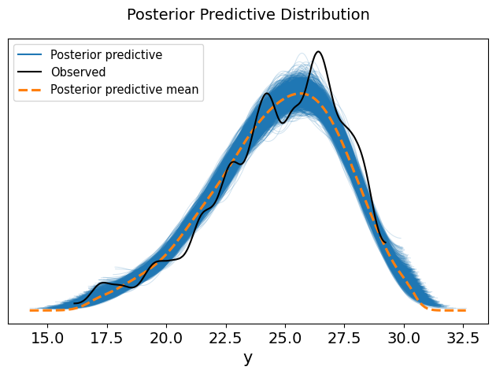
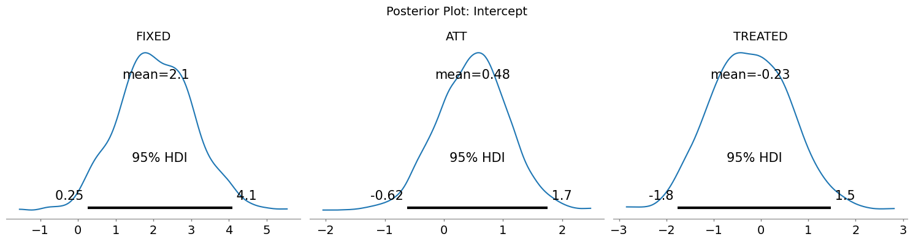

# Analysis of the Effect of Lifting Social Distancing Across Commercial Districts & Industries in Seoul

- Period: 2024.05.

- Professor: [`Chung,Y.`](https://github.com/ychungkmu)

- Team: [`Wang,J.`](https://github.com/jayarnim)

## idea

The COVID-19 period, which began in the second quarter of 2020, officially came to an end with the lifting of social distancing measures in the second quarter of 2022. However, public expectations regarding this announcement were divided. On one hand, some anticipated that household consumption, which had been severely suppressed, would recover substantially. On the other hand, others argued that actual recovery had already taken place since the second half of 2021, due to the decline in infection rates and the desensitization to the COVID-19 shock, and that the announcement merely formalized an existing reality.

Against this backdrop, this study applies the Difference-in-Differences (DiD) approach to estimate the causal effect of the lifting of social distancing on small business sales in Seoul. While the policy announcement was expected to have a generally positive effect, it was hypothesized that both the magnitude and direction of the effect would vary depending on the type of commercial district and the industrial sector.

The patterns of these causal effects were not assumed to be independent across commercial and industrial categories. Factors such as increased outdoor activity, improved consumer sentiment driven by expectations of economic recovery, and the relaxation of health-related sensitivity after the end of the pandemic were likely to interact in complex and interdependent ways, producing heterogeneous yet correlated responses across area–industry combinations. To capture these interrelated and hierarchical structures, this study employed a Bayesian hierarchical model.

The validity of the DiD estimation relies on the parallel trend assumption. However, because this study defines its analytical unit as an area–industry cross-classified unit, the treatment status and its intensity cannot be clearly delineated. To address this structural limitation, the treatment indicator was modeled as a probabilistic variable, allowing the causal effect of the policy announcement to be estimated in a probabilistic framework.

## DiD

- model definition:

$$
Y_{i,k,t}
:=\underbrace{\omega+\alpha_{i}+\beta_{k} + \gamma_{t}}_{\text{fixed effects}}+\underbrace{(\delta + p_{i} + q_{k})(D_{i,k} \times T_{t})}_{\text{causal effect of social distancing}}+\epsilon_{i,k,t}
$$

### bayesian hierarchical model

- level 1:

$$
Y_{i,k,t} \mid \alpha_{i},\beta_{k},\gamma_{t},p_{i},q_{k},\omega,\delta,\sigma \sim \mathcal{N}(\mu_{i,k,t},\sigma^{2})
$$

- level 2:

$$\begin{aligned}
\alpha_{i} \mid \tau_{\alpha} &\sim \mathcal{N}(0,\tau_{\alpha}^{2}) \quad i=1,\cdots,N\\
\beta_{k} \mid \tau_{\beta} &\sim \mathcal{N}(0,\tau_{\beta}^{2}) \quad k=1,\cdots,K\\
\gamma_{t} \mid \tau_{\gamma} &\sim \mathcal{N}(0,\tau_{\gamma}^{2}) \quad t=1,\cdots,T\\
p_{i} \mid \tau_{p} &\sim \mathcal{N}(0,\tau_{p}^{2}) \quad i=1,\cdots,N\\
q_{k} \mid \tau_{q} &\sim \mathcal{N}(0,\tau_{q}^{2}) \quad k=1,\cdots,K
\end{aligned}$$

- level 3:

$$\begin{aligned}
\tau_{\alpha} &\sim \mathrm{HalfNormal}(1)\\
\tau_{\beta} &\sim \mathrm{HalfNormal}(1)\\
\tau_{\gamma} &\sim \mathrm{HalfNormal}(1)\\
\tau_{p} &\sim \mathrm{HalfNormal}(1)\\
\tau_{q} &\sim \mathrm{HalfNormal}(1)
\end{aligned}$$

- posterior estimation:

$$\begin{aligned}
\underbrace{p(\alpha_{i},\beta_{k},\gamma_{t},p_{i},q_{k},\omega,\delta,\sigma \mid Y_{i,k,t})}_{\text{posterior}}
&\propto \underbrace{p(Y_{i,k,t} \mid \alpha_{i},\beta_{k},\gamma_{t},p_{i},q_{k},\omega,\delta,\sigma)}_{\text{likelihood}}\\
&\quad\times p(\omega) \cdot \underbrace{p(\alpha_{i} \mid \tau_{\alpha})p(\tau_{\alpha})}_{\propto p(\tau_{\alpha} \mid \alpha_{i})} \cdot \underbrace{p(\beta_{k} \mid \tau_{\beta})p(\tau_{\beta})}_{\propto p(\tau_{\beta} \mid \beta_{k})} \cdot \underbrace{p(\gamma_{t} \mid \tau_{\gamma})p(\tau_{\gamma})}_{\propto p(\tau_{\gamma} \mid \gamma_{t})}\\
&\quad\times p(\delta) \cdot \underbrace{p(p_{i} \mid \tau_{p})p(\tau_{p})}_{\propto p(\tau_{p} \mid p_{i})} \cdot \underbrace{p(q_{k} \mid \tau_{q})p(\tau_{q})}_{\propto p(\tau_{q} \mid q_{k})}\\
&\quad\times p(\sigma)
\end{aligned}$$

### uncertainty in treatment assignment

- level 1:

$$
D_{i,k} \mid \pi_{i,k} \sim \mathrm{Bernoulli}(\pi_{i,k})
$$

- level 2:

$$
\pi_{i,k} := \sigma(\eta + u_{i} + v_{k})
$$

- level 3:

$$\begin{aligned}
\eta &\sim \mathcal{N}(0,1^{2})\\
u_{i}\mid\tau_{u} &\sim \mathcal{N}(0,\tau_{u}^{2}), \quad \tau_{u} \sim \mathrm{HalfNormal}(1)\\
v_{k}\mid\tau_{v} &\sim \mathcal{N}(0,\tau_{v}^{2}), \quad \tau_{v} \sim \mathrm{HalfNormal}(1)
\end{aligned}$$

- parallel trends assumption:

$$\begin{gathered}
\mathbb{E}\left[Y_{i,k,t}(0)-Y_{i,k,s}(0) \mid \pi_{i,k}\right]
= \mathbb{E}\left[Y_{i,k,t}(0)-Y_{i,k,s}(0)\right]\\
\Updownarrow\\
(Y_{i,k,t}(0)-Y_{i,k,s}(0))
\perp D_{i,k} \mid \pi_{i,k}
\end{gathered}$$

- posterior estimation:

$$\begin{aligned}
p(\pi_{i,k} \mid D_{i,k})
&\propto \underbrace{p(D_{i,k}\mid\pi_{i,k})\cdot p(\pi_{i,k}\mid\eta,u_{i},v_{k})}_{\propto p(\pi_{i,k}\mid D_{i,k})}\\
&\quad\times p(\eta)\cdot \underbrace{p(u_{i}\mid \tau_{u})p(\tau_{u})}_{\propto p(\tau_{u}\mid u_{i})}\cdot \underbrace{p(v_{k}\mid \tau_{v})p(\tau_{v})}_{\propto p(\tau_{v}\mid v_{k})}
\end{aligned}$$

## experiment

### Data

This study utilises estimated sales data for small business owners provided by the Seoul Open Data Plaza, covering the period from 2Q 2020 to 1Q 2024.

- Seoul Open Data Plaza [`link`](https://data.seoul.go.kr/dataList/OA-15572/S/1/datasetView.do)

The dataset comprises information on estimated sales for a total of 4 types of business districts, 1,596 business districts, and 63 industry categories. For the sake of analytical convenience, individual business-district identifiers were omitted, using only the business-district type and industry category as identifiers. Because the sales distribution contained many extreme values, a log transformation was applied. Accordingly, the dependent variable in this analysis is not the amount of sales per se, but rather the rate of change in sales.

### Unit Definition

The four business-district types as defined by the Seoul Business-District Analysis Service are as follows ([`refer`](https://golmok.seoul.go.kr/introduce.do)):

- **골목상권**: a commercial domain formed along narrow roads within residential areas rather than along main thoroughfares  
- **관광특구**: a business district located within a spatial area where tourism activities are primarily conducted  
- **발달상권**: a business-facility concentration area in which more than 50 stores are clustered within a walkable radius of 2,000 m²  
- **전통시장**: a permanent market or periodic market that has naturally developed over a long period in a specific region  

Industries were re-classified into 13 categories based on similarity and relevance:

- **가전제품업**: computers & peripherals, home appliances, appliance repair, mobile phones  
- **건강서비스업**: general clinics, dental clinics, oriental medicine clinics  
- **건강소매업**: pharmaceuticals, medical devices  
- **교육서비스업**: general tutoring academies, art academies, foreign-language academies  
- **부동산업**: real-estate brokerage  
- **사치재소매업**: stationery, hardware stores, sporting goods, bags, shoes, toys, textiles, watches & jewellery, interior goods, furniture, lighting, plants, apparel, books  
- **생활서비스업**: hair salons, nail salons, laundries, opticians, skin-care centres, pet services  
- **숙박업**: goshiwon, guesthouse  
- **실내여가업**: sports training, sports clubs, PC cafés, karaoke, billiard halls, golf practice ranges  
- **외식업**: Korean restaurants, snack shops, pubs & bars, bakeries, coffee & beverages, Japanese restaurants, fast foods, Western restaurants, Chinese restaurants, chicken specialty shops, side-dish stores  
- **자동차업**: automobile repair, car wash/beauty, bicycles and other transportation equipment  
- **전자상거래업**: e-commerce  
- **필수재소매업**: convenience stores, supermarkets, meat retail, fruit & vegetable stores, grain retailers, seafood retailers, cosmetics  

### Posterior Convergence

This study conducted posterior-distribution inference using MCMC (Markov Chain Monte Carlo). Four Markov chains were run in parallel. The categorical variable of treatment status $$D_{i,k}$$ was sampled via the Binary Gibbs–Metropolis algorithm, while the remaining continuous parameters were sampled using NUTS (No-U-Turn Sampler). A burn-in of $$5{,}000 \times 4$$ initial samples was applied during the tuning phase, and from the subsequently sampled $$5{,}000 \times 4$$ samples, we extracted every 10th sample to mitigate autocorrelation, resulting in a final analysed sample of $$500 \times 4$$.

As can be seen in the graph above, the posterior predictive distribution broadly matches the observed data. Convergence diagnostics for the posterior distributions indicated overall adequacy. For the key parameters ($$\omega, \alpha, \beta, \gamma, \delta, p, q, \eta, u, v$$), we checked $$MCSE \leq 0.1$$, $$ESS_{bulk} \geq 400$$, $$ESS_tail \geq 100$$, and $$\hat{R} \leq 1.05$$, and found that most parameters satisfied these criteria. However, for the treatment-probability deviations by business-district type ($$u$$) and by industry ($$v$$), some metrics slightly violated the criteria (excluding $$\hat{R}$$).

## result

### Expected ATT Interpretation

The proposed model is based on a Bayesian approach rather than a conventional frequentist framework. In frequentist settings, probability represents the relative frequency of long-run repetition, whereas in the Bayesian paradigm, probability denotes a degree of belief given available information. This difference implies that parameter interpretation in the Bayesian context diverges from standard frequentist estimates.

In our study, the treatment probability is not the observed frequency of “policy applied,” but rather the posterior uncertainty regarding whether the policy impacted a given unit. Accordingly, the estimated causal effect (ATT) is not the “average response of treated units,” but rather the posterior expected response for a given unit if it were treated.

In frequentist inference, the expected causal effect is defined as follows:

$$
\mathbb{E}\left[(\delta + p_{i} + q_{k})(D_{i,k} \times T_{t})\right]
=\begin{cases}
(\delta + p_{i} + q_{k})T_{t} \quad &\mathrm{if}\quad D_{i,k}=1 \\
0 \quad &\mathrm{otherwise}
\end{cases}
$$

In Bayesian inference, the expected causal effect is given by:

$$
\mathbb{E}\left[(\delta + p_{i} + q_{k})(D_{i,k} \times T_{t})\right]
=\pi(\delta + p_{i} + q_{k})T_{t}
$$

Thus, while in the frequentist framework the expected causal effect refers to an observed average effect restricted to units that actually received the treatment, in the Bayesian framework it is interpreted as a posterior expected effect that incorporates uncertainty in treatment assignment.

### Analysis: Intercept

The intercept parameters correspond to the average fixed-effect $$\omega$$, the average causal effect $$\delta$$, and the average treatment-logit $$\eta$$.

The graphs above show the posterior distributions of these three parameters. The average treatment logit is estimated at $$\eta = -0.23$$. Converting this to probability yields $$\sigma(\eta) \approx 0.443$$, which means that the likelihood of the social-distancing easing announcement affecting any given small-business unit is estimated at approximately $$44.3\%$$ on average.

The average causal effect is estimated at $$\delta = 0.48$$; converting from the log-scale of sales to a rate of change gives $$\exp(\delta) - 1 \approx 0.614$$. Accounting for probabilistic treatment assignment, the expected percentage change is given by $$\pi\left(\exp(\delta)-1\right)=0.443(\exp(0.48)-1)\approx0.273$$, indicating that, once treatment uncertainty is taken into account, small-business sales are estimated to have increased by approximately $$27.3\\%$$ on average compared to the prior period.

### Analysis: Area Type

| Area type | Treated Prob. | ATT | Expected ATT |
|:---:|:---:|:---:|:---:|
| 골목상권 | $$1.9\\%$$ | $$+947.1\\%$$ | $$+18.0\\%$$ |
| 관광특구 | $$49.2\\%$$ | $$−41.3\\%$$ | $$-20.3\\%$$ |
| 발달상권 | $$0.75\\%$$ | $$+209.0\\%$$ | $$+1.6\\%$$ |
| 전통시장 | $$99.8\\%$$ | $$−19.1\\%$$ | $$-19.0\\%$$ |

Examining the treated-probabilities $$\sigma(\eta + u_{i})$$ by area type reveals that 골목상권 ($$1.9\\%$$) and 발달상권 ($$0.75\\%$$) had very low probabilities, indicating these were not the primary direct targets of the policy. In contrast, 전통시장 ($$99.8\\%$$) had a very high probability, pointing to it being a core implementation target, while 관광특구 ($$49.2\\%$$) lay at an intermediate level. At the same time, the posterior means of causal effects ($$\exp(\delta + p)-1$$) show that 골목상권 and 발달상권 registered large positive responses ($$+18.0\\%$$, $$+1.6\\%$$), whereas 관광특구 and 전통시장 exhibited negative responses ($$-20.3\\%$$, $$-19.0\\%$$).

This pattern can be interpreted as follows: 골목상권 and 발달상권 were not originally the direct focus of the social-distancing easing policy, and thus the announcement served as an explicit signal, triggering a rapid rebound in consumer sentiment and sales. On the other hand, 관광특구 and 전통시장 had already been part of the policy’s main application domain, and the easing announcement essentially formalised a recovery process that was already underway. As a result, their additional improvement potential following the announcement was limited, and in some cases a compensatory effect emerged.

### Analysis: Industry

| Industry | Treated prob. | ATT | Expected ATT |
|:---:|:---:|:---:|:---:|
| 가전제품업 | $$13.4\\%$$ | $$−0.9\\%$$ | $$-0.12\\%$$ |
| 건강서비스업 | $$9.8\\%$$ | $$+246.3\\%$$ | $$+24.1\\%$$ |
| 건강소매업 | $$9.7\\%$$ | $$+76.0\\%$$ | $$+7.4\\%$$ |
| 교육서비스업 | $$99.8\\%$$ | $$−0.2\\%$$ | $$-0.2\\%$$ |
| 부동산업 | $$3.2\\%$$ | $$−68.6\\%$$ | $$-2.2\\%$$ |
| 사치재소매업 | $$44.4\\%$$ | $$+605.7\\%$$ | $$+269.0\\%$$ |
| 생활서비스업 | $$6.4\\%$$ | $$+101.3\\%$$ | $$+6.5\\%$$ |
| 숙박업 | $$5.8\\%$$ | $$−0.9\\%$$ | $$-0.05\\%$$ |
| 실내여가업 | $$9.6\\%$$ | $$+230.7\\%$$ | $$+22.1\\%$$ |
| 외식업 | $$43.9\\%$$ | $$+249.3\\%$$ | $$+109.5\\%$$ |
| 자동차업 | $$99.8\\%$$ | $$−36.7\\%$$ | $$-36.6\\%$$ |
| 전자상거래업 | $$49.2\\%$$ | $$−62.6\\%$$ | $$-30.8\\%$$ |
| 필수재소매업 | $$6.6\\%$$ | $$+558.0\\%$$ | $$+36.8\\%$$ |

Looking across industries, those with treated probabilities below $$10\\%$$ (e.g., 건강서비스업, 건강소매업, 생활서비스업, 필수재소매업) were generally not direct policy targets and exhibited high positive ATT. In contrast, industries such as 교육서비스업 and 자동차업 had treated probabilities around $$100\\%$$, consistent with policy application targets. Industries in the $$40\\% ~ 50\\%$$ range (e.g., 사치재소매업, 외식업, 전자상거래업) were partially exposed. The highest positive ATT values occurred in industries such as 사치재소매업 ($$+269.0\\%$$), 필수재소매업 ($$+36.8\\%$$), 건강서비스업 ($$+24.1\\%$$), and 외식업 ($$+109.5\\%$$). Meanwhile, industries such as 교육서비스업, 자동차업, 전자상거래업, 부동산업, 숙박업 displayed negative ATT.

As with the area-type analysis, a clear inverse relationship emerges: industries with low treated probability tend to exhibit high positive ATT, whereas those with high treated probability show low or negative ATT. This suggests that in sectors with low exposure probability, the easing announcement functioned as a consumer-sentiment recovery trigger, while in sectors already richly exposed the announcement marked a stage of policy-expectation exhaustion or adjustment phase.